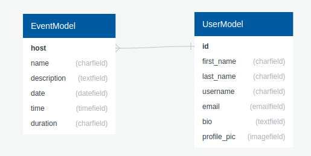
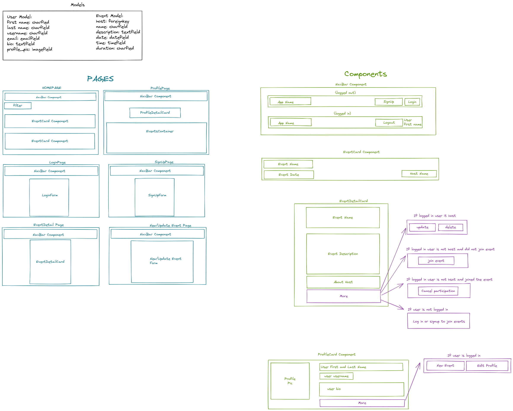
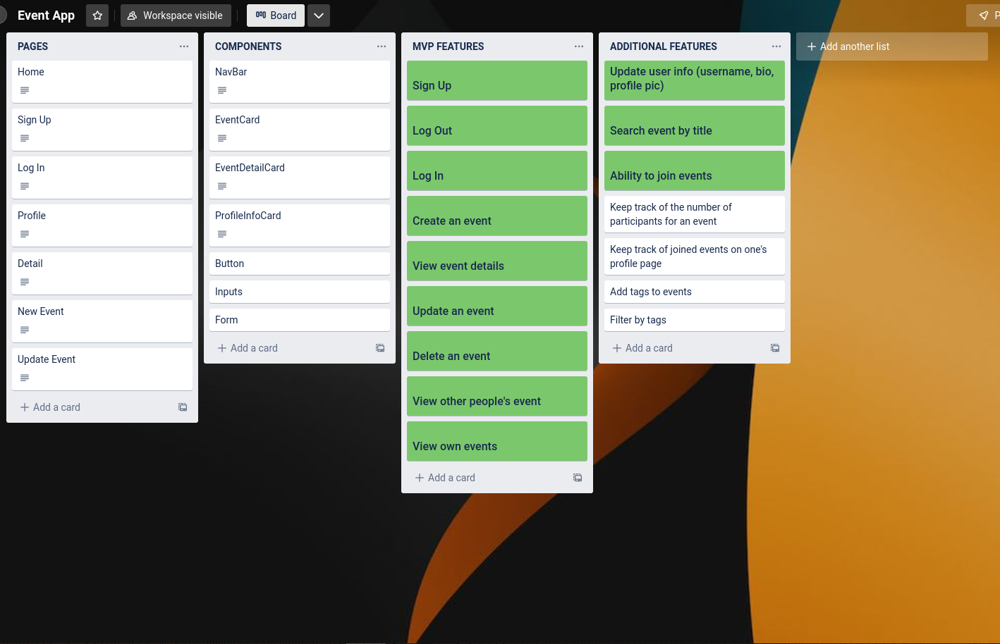

# Project 4: Eventech

## Description
Eventech is a tech related event app. Users can view online events. They can also create, update, and delete their own events when they are logged in. It also allows users to join online events. 

## Deployment Link
You can find the deployed app here:
[Eventech](http://bit.ly/3yq6KxO)

## Timeframe and Working Team
This project, which was done individually, had a timeframe of 20 days. 

## Technologies Used
- HTML
- CSS
- JavaScript
- React
- Python
- Django
- Poetry
- PostgreSQL
- TablePlus
- Insomnia
- Git
- GitHub
- Chrome's Developer Tools
- Visual Studio Code
- Excalidraw
- Trello

## Brief
The brief for this project stated that we had to:
- Build a full stack application by making our own backend and frontend
- Use a Django API to serve our data from a PostgreSQL database
- Consume our API with a separate frontend built with React
- Have multiple relationships and CRUD functionalities for at least a couple of models
- Implement thoughtful user stories/wireframes
- Have a visually impressive design
- Be deployed online

## Planning

### Building the Backend Models
After we went through the brief together in class, the first thing I did was plan the backend models I would need. I thought about the necessary fields, the type of fields they would be, and how they connected.



### Wireframing
Once I was done with the models, I started to work on the wireframe of my app. I drew the main pages and the components I would need.



Next, I created a Trello board. 

### Trello
During this project, I used a Trello board to track my progress. (The green features are the ones I managed to complete)



Following the Trello board creation, I created a repo and added my initial client and server folders and files.

## Code Process

### Adding the Pages, Components, and Utils
After I was done planning, I created the pages, components, and utilities I would need in the frontend. I also added the routes in App.js

### Working on the User Model
Once I was done working on the initial pages and components of the frontend, I decided to focus on the backend. I noticed that the username field was always required when creating a user, so I did some research about how to create a custom user model so that the email was required instead of a username. I thought it would be more practical to ask users for an email instead of a username. I read the documentation and a few blogs, I also watched YouTube videos. Following a few experiments, I was able to create a custom user model where the username field was not required to register. 

```
class CustomUser(AbstractUser):
    username = models.CharField(max_length=200, null=True, blank=True)
    first_name = models.CharField(max_length=240)
    last_name = models.CharField(max_length=240)
    email = models.EmailField(_('email address'), unique=True)
    bio = models.TextField(null=True, blank=True)

    objects = UserManager()

    USERNAME_FIELD = 'email'
    REQUIRED_FIELDS = ['first_name', 'last_name']
```

### Working on Authentication
When I finished creating the custom user model, I connected my backend to my frontend; and I started working on the sign up, log in, and log out features. The process for these features was quite straightforward as it was something we had gone over in class. All I had to do was revisit my code and customize it to make it work for my app. 

### Creating Custom Inputs Components
When the authentication features were working, I created custom inputs for my NewEventPage and UpdateEventPage. The two pages looked very similar so creating custom inputs would have prevented code repetition. Once the state’s of the inputs were properly being updated, I continued with the next step.

### Working on the Event Model, Serializers, and Views
Next, I created the event model and ran the migrations. I then created the serializer for the event model. Following that, I created the views for the models. For the views, I used the APIView from rest_framework. The first requests I made were a GET request, to get a list of all events, and a POST request, to post a new event. 

Then, I tested if the post request to create an event worked. However, I got an error saying “cannot assign must be an instance.” It was due to how I was trying to assign a user as the event’s host. To solve this issue, instead of assigning request.user.id to host, I assigned it to host_id. 

### Connected Backend GET and POST Request to Frontend
When the GET and POST requests were working, I connected it to the frontend. However, I got errors when I tried importing the asynchronous functions that were making the requests. After 
some debugging, I found out that there was an issue with how I was exporting the functions. 

### Creating the GET, UPDATED, and DELETE Requests for Single Events
Once the GET and POST requests were working both in the backend and frontend, I started working on the views for single events. I created a GET request to get a single event, a PATCH request to update an event, and a DELETE request to delete an event. 

After making sure that the requests were working properly in the backend using Insomnia, I connected it to the frontend. I also created the buttons and functions to perform the actions for these events. 

### Adding the Search Functionality
Following the completion of the CRUD functionalities, I created the search feature. It is a feature that allows users to search for an event by title. To do so, I used the query params in the backend. I then connected it to the frontend. 

```
def get(self, request):
    events = Event.objects.all().order_by('-id')

    name = request.query_params.get("name")

    if name is not None or "":
        events = events.filter(name__icontains=name)

    serializer = PopulatedEventSerializer(events, many=True)
    return JsonResponse(serializer.data, safe=False)
```

The search feature was able to return the events with the certain keywords in their title. However, the GET request was being called every time any key from the keyboard was pressed. I realized it was performing too many requests. To solve this issue, I decided to use a debouncer. With this, the user could type a word before the GET request was made. 

```
const useDebounce = (value, delay) => {
  const [debounceValue, setDebounceValue] = useState(value);

  useEffect(() => {
    const handler = setTimeout(() => {
      setDebounceValue(value);
    }, delay);

    return () => {
      clearTimeout(handler);
    };
  }, [value, delay]);

  return debounceValue;
};
```

### Working on a User's Profile
Shortly after that, I started to work on the PATCH request to update a user’s profile. I was able to update a user’s information. However, it required that I provide the password and password information. That was obviously something I wanted to avoid. In order to fix this issue, I created another user serializer to handle the PATCH request. 

After successfully creating the PATCH request, I created another GET request to fetch only the events of a particular user. Once both requests were working in the backend, I connected them to the frontend. I created the form to update a user’s profile, and I added the EventCard components in the ProfilePage to display a user’s events. 

### Styling
Once the main functionalities were working, I started working on my CSS. To start with, I brainstormed about the theme of the app and its styling. Here are a few websites that helped me:
- [Coolors](https://coolors.co/): helped finding the color theme for the app
- [Fontjoy](https://fontjoy.com/): helped find font-family combinations

After I found the theme and the fonts I wanted to use for my app, I started working on the layouts of the pages and the components. For the styling of my app, I used a few online tools that made the styling process a lot smoother:
- [SVG Backgrounds](https://www.svgbackgrounds.com/): used for the background of my EventCard component
- [Smooth Shadow](https://shadows.brumm.af/): used to create shadows
- [Buttons Generator](https://markodenic.com/tools/buttons-generator/): used for styling buttons

Once my app looked decent, I added the” join event” and “cancel participation” functionalities. 

### Working on the Joined Events
I decided to work on the joined events functionality after the CSS because I was unsure of the difficulty of working with ManyToMany relationships in Django. However, it was a lot smoother than I thought it would be. The documentation was straightforward, and there were many useful tutorials on YouTube. 

I was able to add a user as a participant to an event by using the add method, and I was able to remove a user as a participant from an event by using the remove method. 

```
def post(self, request, pk):
    event = Event.objects.get(id=pk)
    user = request.user.id
    event.participant.add(user)
    serializer = EventSerializer(event, request.data)
    if serializer.is_valid():
        serializer.save()
    return JsonResponse({"message":"You've successfully registered to an event"})
```

```
def delete(self, request, pk):
    event = Event.objects.get(id=pk)
    user = request.user.id
    event.participant.remove(user)
    return JsonResponse({"message":"You've successfully cancelled your participation in the event"})
```

Once both the add and remove functionalities were working, I displayed the events a user joined in their profile page. 

## Challenges

### Custom User
Working on the custom user was definitely one of the biggest challenges of this project. It took a considerable amount of time to create a user without having to provide a username. I also had issues when updating a user’s data. Nevertheless, it was an insightful experience.

### Styling
Styling was quite hard. Not the CSS part, but the styling in general. Having to choose the theme colors, fonts, and page and components layout felt strenuous. 

## Wins

### Join Event/Cancel Participation
I think the functionalities to join an event and cancel a participation to an event were major wins in this project. This was also my first time working with a ManyToMany relationship in Django. I found this experience to be fruitful and enjoyable. 

### Custom User
Although I had a lot of issues creating the custom user model, I think it was a success. I was able to achieve what I wanted to achieve.

### Search Functionality
The search functionality of this app was also a success. I particularly enjoyed learning about the query params in Django. 

## Key Learnings

### ManyToMany Relationship
With this project, I was able to work with a ManyToMany relationship for the first time. I greatly enjoyed learning about how the relationships were created and how they looked in the database. 

### Custom User Model
I spent a considerable amount of time studying custom user models during this project. With that time, I was able to learn a lot about creating custom user models. 

### Debouncing
Working on the search functionality introduced me to debouncing. After learning about it, I could picture various situations where it would be useful to use. 

## Bugs

### Backend Permissions
At the moment, there is security placed in the frontend. Certain pages or features will only be accessible under some circumstances. For example, only event hosts can delete or update their events. 

However, there is no permission yet in the backend. To fix this issue, I would need to add permission classes in the views. 

## Future Improvements

### Adding Permissions to Views
In order to add security, I would add permission classes in the views. This will ensure that not just anyone can create, update, delete events. 

### Creating Future Events
At the moment, it is possible to create an event with a date and time that has already passed. It would not make sense to create an event and host it on a date that has already passed. 

### Event Status
In the future, I would like to add an ongoing status to an event, True or False. Events with an ongoing status of True are the upcoming events, and events with an ongoing status of False are events that have already been held. 

Newly created events would automatically have an ongoing status of True, and once the deadline has passed, the ongoing status would be changed to false. With this, it will be possible to only display the upcoming events only. 

### Uploading a Profile Picture
The feature to upload a profile picture is a feature that I wanted to implement in this project since the beginning. Although I had tried uploading images, it turned out to be more difficult than I expected. 

### Adding Tags to Events and Filtering by Tags
Adding tags to an event would be a useful feature. It would also allow me to create a filter functionality to filter events by tags. 


